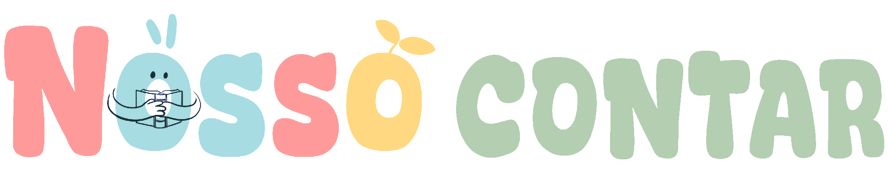

# 

> Entre em um mundo de gestos, histórias e descobertas em Libras.

---

## 💡 Sobre o Projeto

O **Nosso Contar** nasceu na disciplina de **Libras** do curso de **Ciência da Computação do IFCE**, a partir do desafio de criar um **sistema educativo inclusivo** voltado à aprendizagem em Libras.

Durante o desenvolvimento, observamos que muitas crianças surdas enfrentam dificuldades na alfabetização visual e gestual, e que o mundo digital ainda carece de ferramentas acessíveis e atrativas.

Dessa percepção surgiu o **Nosso Contar**: uma plataforma **lúdica, acessível e interativa** que ensina Libras por meio de **vídeos educativos, trilhas de aprendizado, histórias infantis e jogos de memória**, promovendo o aprendizado de forma envolvente e significativa.

---

## 🎯 Objetivo

Promover a **alfabetização bilíngue** em Libras para crianças, utilizando **recursos visuais e interativos** que estimulem a curiosidade, a imaginação e a inclusão digital.

---

## 🚀 Funcionalidades

### 🧩 Trilhas de Aprendizagem

* Módulos com **palavras do cotidiano**, **alfabeto** e **números**.
* Vídeos em Libras com legendas em português.
* Estrutura gamificada que acompanha o progresso do usuário.

### 📚 Histórias Infantis

* Contos narrados em Libras, e com **legendas**.
* Abordam **emoções, valores e vocabulário funcional** (como dias da semana, família e sentimentos).
* Integram o aprendizado de forma contextualizada e encantadora.

---

## 🧠 Público-Alvo

Crianças surdas em processo de alfabetização, estudantes ouvintes interessados em aprender Libras, e educadores que buscam ferramentas inclusivas para o ensino bilíngue.

---

## 🛠️ Tecnologias Utilizadas

| Categoria              | Tecnologias                                   |
| ---------------------- | --------------------------------------------- |
| **Frontend**           | React, TailwindCSS, LucideReact               |
| **Design e Protótipo** | Figma                                         |
| **Versionamento**      | Git e GitHub                                  |

---

## 🌍 Impacto

O **Nosso Contar** vai além do ensino de sinais — ele cria **pontes entre mundos**, incentivando o respeito, a empatia e a acessibilidade.
É um convite para que o aprendizado em Libras seja não apenas educativo, mas também **emocional e inclusivo**.

---

## 👩‍💻 Equipe

Projeto desenvolvido por estudantes do **Instituto Federal do Ceará (IFCE)**, como parte da disciplina de **Libras**, unindo tecnologia, criatividade e propósito social.

Integrantes:
- [Cláudia Ferreira](https://github.com/claudia-souza)
- [Laís Coutinho](https://github.com/laiscoutinho)
- [Rosana Celine](https://github.com/RosanaCeline)
- [Thais Araujo](https://github.com/thaisaraujo19)
- [Thalyta Lima](https://github.com/thalytalima211)

---

## 📎 Licença

Este projeto é de uso acadêmico e educativo. Todos os direitos reservados às autoras.

---